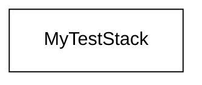
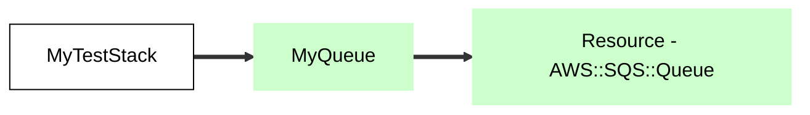
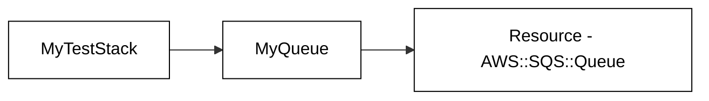
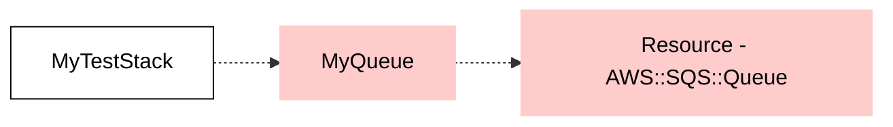

# Architecture Aspect

This CDK Aspect traverse the tree to generate a GitHub / markdown compatible mermaid chart.

During each stack synthesis it will write a markdown file based on the stack's id.  For example:

`new Stack(new App(), 'asdf');`

would create a markdown file called `asdf.md`.

On each subsequent synthesis, the Aspect will read the stack's existing markdown file (if it exists) and infer architecture changes b/w before and after.

This uses no external dependencies!

- Green boxes indicate resources that were added
- Red boxes indicates resources that were removed
- Thick arrow lines indicate a new linkage
- Normal arrow lines indicate an existing linkage
- dashed/dotted arrow lines indicate a removed linkage

## Example - Simple Stack

## Example - Queue Added to Stack

## Example - Stack re-synthed AFTER the queue was added

## Example - Queue Removed

## Example - Stack re-synthed AFTER the queue was removed

