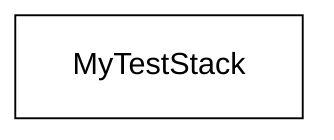
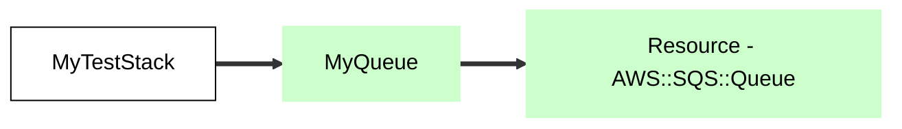
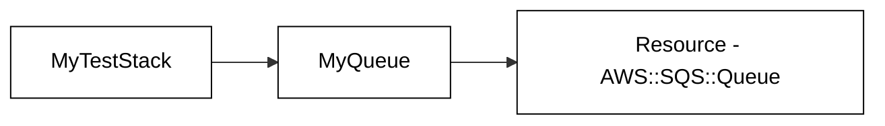
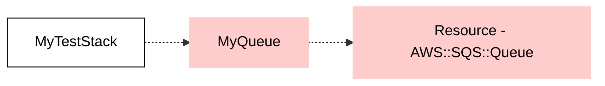

# Architecture Diagram Aspect

This CDK Aspect traverses the stack to generate a GitHub / markdown compatible mermaid chart of the AWS Resources created by the stack.

It outputs this as a markdown folder based on the stack's id.  For example:

`new Stack(new App(), 'asdf');`

would create a markdown file called `asdf.md`.

On each subsequent synthesis, the Aspect will read the stack's existing markdown file (if it exists) and infer architecture changes b/w before and after.  It will then replace the markdown file with a visual diff of the architecture (see examples below).

This uses no external dependencies!

- Green boxes indicate resources that were added
- Red boxes indicates resources that were removed
- Thick arrow lines indicate a new linkage
- Normal arrow lines indicate an existing linkage
- dashed/dotted arrow lines indicate a removed linkage

## Installation Instructions

`npm install @aws-community/arch-dia --save-dev`

then add the aspect to your Stack

```
const myStack = new Stack(app, 'MyStack');
const archDia = new ArchitectureDiagramAspect();
Aspects.of(myStack).add(archDia);
archDia.generateDiagram();
```

## Example 1 - Simple Stack



## Example 2 - Queue Added to Stack



## Example 3 - Stack re-synthed AFTER the queue was added



## Example 4 - Queue Removed



## Example 5 - Stack re-synthed AFTER the queue was removed


## Example 6 - A More Complex Change

In this example I changed the SelfDestructConstruct's id in the SelfDestructStack from [`@aws-community/self-destruct`](https://github.com/aws-community-projects/self-destruct)

```mermaid
graph LR;
c814b2c5dc22d11a84e78a63be7bb7815715b70534[MyTestStack]
c814b2c5dc22d11a84e78a63be7bb7815715b70534[MyTestStack] --> c80af741cb2cb4b820501f9db156b5ad6d466f2c40[DefaultCrNodeVersionMap]
c814b2c5dc22d11a84e78a63be7bb7815715b70534[MyTestStack] --> c814b796835a46b46f562e4fec24744f79c0e8a6c6[AWS679f53fac002430cb0da5b7982bd2287]
c814b796835a46b46f562e4fec24744f79c0e8a6c6[AWS679f53fac002430cb0da5b7982bd2287] --> c8c4cb1cdac5e4ce33049155a3100eb458b8c3fc92[ServiceRole]
c8c4cb1cdac5e4ce33049155a3100eb458b8c3fc92[ServiceRole] --> c896b88ae08866f2fd84e3381fdcfef602ddf115e0[ImportServiceRole]
c8c4cb1cdac5e4ce33049155a3100eb458b8c3fc92[ServiceRole] --> c8e147fab0f248fba7acf510a427238616a5594caf[Resource - AWS::IAM::Role]
c814b796835a46b46f562e4fec24744f79c0e8a6c6[AWS679f53fac002430cb0da5b7982bd2287] --> c886a5938c919902b3f83e356270aaca7eb024ca37[Code]
c886a5938c919902b3f83e356270aaca7eb024ca37[Code] --> c850745224509f9fad04f5dcf344587a71d12a20a9[Stage]
c886a5938c919902b3f83e356270aaca7eb024ca37[Code] --> c840b81d4f9aece5445022d425c2a723daa0058440[AssetBucket]
c814b796835a46b46f562e4fec24744f79c0e8a6c6[AWS679f53fac002430cb0da5b7982bd2287] --> c8a6605aad4f358e7b3588d39706e10e288e22cceb[Resource - AWS::Lambda::Function]
c814b2c5dc22d11a84e78a63be7bb7815715b70534[MyTestStack] ==> c85973ed60c8087738f3313c08800bcaf270a8baf2[SelfDestructConstruct]:::added
c85973ed60c8087738f3313c08800bcaf270a8baf2[SelfDestructConstruct]:::added ==> c867441ef67820df03b6f190a1b4f2bdb69f6bbfb7[ListExecutions]:::added
c85973ed60c8087738f3313c08800bcaf270a8baf2[SelfDestructConstruct]:::added ==> c8c357b9bbc491af6e16abfe3eafec2c9f7f7a017e[ExecutionsMap]:::added
c85973ed60c8087738f3313c08800bcaf270a8baf2[SelfDestructConstruct]:::added ==> c8ce567f4cc9c92c93edf6262d51437f6f8663e68c[StopExecution]:::added
c85973ed60c8087738f3313c08800bcaf270a8baf2[SelfDestructConstruct]:::added ==> c86e2668734812ee49ac23711e6022ace1b37d968c[NotSelf?]:::added
c85973ed60c8087738f3313c08800bcaf270a8baf2[SelfDestructConstruct]:::added ==> c8754ab4082392b269420307a1f94c1807e5351fbc[self]:::added
c85973ed60c8087738f3313c08800bcaf270a8baf2[SelfDestructConstruct]:::added ==> c8ab16dca8b8e7ae2cdc945f053403d17d4bb13293[Wait]:::added
c85973ed60c8087738f3313c08800bcaf270a8baf2[SelfDestructConstruct]:::added ==> c8a204c18cba769b058b9be6f915c73ea245ed987d[WasDelete?]:::added
c85973ed60c8087738f3313c08800bcaf270a8baf2[SelfDestructConstruct]:::added ==> c8d240060f869165e19dd78cdb64384fd3b6cfe988[DeleteSuccess]:::added
c85973ed60c8087738f3313c08800bcaf270a8baf2[SelfDestructConstruct]:::added ==> c84173268981abc959f512c51e020c39ec7ae3ec76[DeleteStack]:::added
c85973ed60c8087738f3313c08800bcaf270a8baf2[SelfDestructConstruct]:::added ==> c81bcee72c5b9f23f9ca3aa55557309f487d0e9c3f[Finished]:::added
c85973ed60c8087738f3313c08800bcaf270a8baf2[SelfDestructConstruct]:::added ==> c8750c972d7672c4145d53ca9a0e1d1aec24590c54[SelfDestructMachine]:::added
c8750c972d7672c4145d53ca9a0e1d1aec24590c54[SelfDestructMachine]:::added ==> c8c88ef2c110d439f324473130061b915e3c78097e[Role]:::added
c8c88ef2c110d439f324473130061b915e3c78097e[Role]:::added ==> c83272a3306ac85223c5458c0e36ae6db2b842f060[ImportRole]:::added
c8c88ef2c110d439f324473130061b915e3c78097e[Role]:::added ==> c8e870cb6ef64aa4ea3535dbb95718a3e12e748991[Resource - AWS::IAM::Role]:::added
c8c88ef2c110d439f324473130061b915e3c78097e[Role]:::added ==> c872d8191fef561add8db78225a6383ca74e353197[DefaultPolicy]:::added
c872d8191fef561add8db78225a6383ca74e353197[DefaultPolicy]:::added ==> c85372e76de21cb43163e6c0e4b8a82d60867d3b38[Resource - AWS::IAM::Policy]:::added
c8750c972d7672c4145d53ca9a0e1d1aec24590c54[SelfDestructMachine]:::added ==> c8fe7706d7c925b14d8403ae82a05d03bbdb5b6c3d[Resource - AWS::StepFunctions::StateMachine]:::added
c85973ed60c8087738f3313c08800bcaf270a8baf2[SelfDestructConstruct]:::added ==> c83208d69c99b7e073b576de11075e8206a88e43ba[SelfDestructCR]:::added
c83208d69c99b7e073b576de11075e8206a88e43ba[SelfDestructCR]:::added ==> c8786fc99ce8e11a472bd0f7a7581ebd776856960a[Provider]:::added
c83208d69c99b7e073b576de11075e8206a88e43ba[SelfDestructCR]:::added ==> c8c485835426778712745f32406acfb3aeb2888ffb[Resource]:::added
c8c485835426778712745f32406acfb3aeb2888ffb[Resource]:::added ==> c8c485835426778712745f32406acfb3aeb2888ffb[Default - Custom::AWS]:::added
c83208d69c99b7e073b576de11075e8206a88e43ba[SelfDestructCR]:::added ==> c81580e5c79f9cbb68791d1d3c87fabefacbe8b39e[CustomResourcePolicy]:::added
c81580e5c79f9cbb68791d1d3c87fabefacbe8b39e[CustomResourcePolicy]:::added ==> c8112158745e0d7b9bbdac346dbfea0a18d26c8d61[Resource - AWS::IAM::Policy]:::added
c814b2c5dc22d11a84e78a63be7bb7815715b70534[MyTestStack] -.-> c80bdb3872d8c7655592d6042091bd6bb0aa9f40f4[SelfDestruct]:::removed
c80bdb3872d8c7655592d6042091bd6bb0aa9f40f4[SelfDestruct]:::removed -.-> c8c54a8196685c157486945a81d7b12e199629d918[ListExecutions]:::removed
c80bdb3872d8c7655592d6042091bd6bb0aa9f40f4[SelfDestruct]:::removed -.-> c81a922dcdd35e5877a70eff4e4bedcb06b49ce546[ExecutionsMap]:::removed
c80bdb3872d8c7655592d6042091bd6bb0aa9f40f4[SelfDestruct]:::removed -.-> c8758780b80cab4431f449ec131710f176ffa6eed7[StopExecution]:::removed
c80bdb3872d8c7655592d6042091bd6bb0aa9f40f4[SelfDestruct]:::removed -.-> c8b45c8e3e155188018a6fb0fb59dffb724fbe9061[NotSelf?]:::removed
c80bdb3872d8c7655592d6042091bd6bb0aa9f40f4[SelfDestruct]:::removed -.-> c8404a3443078f76b7dc166adf3eff9dbc57286632[self]:::removed
c80bdb3872d8c7655592d6042091bd6bb0aa9f40f4[SelfDestruct]:::removed -.-> c8193b74891ee6b528cb4f27dbfb7cda4eb224266e[Wait]:::removed
c80bdb3872d8c7655592d6042091bd6bb0aa9f40f4[SelfDestruct]:::removed -.-> c8eedcb57a4d9221ef99932ff2edfcaa20819074f2[WasDelete?]:::removed
c80bdb3872d8c7655592d6042091bd6bb0aa9f40f4[SelfDestruct]:::removed -.-> c8c0bcaaa5f8c145822db685dcf873efa23374a75f[DeleteSuccess]:::removed
c80bdb3872d8c7655592d6042091bd6bb0aa9f40f4[SelfDestruct]:::removed -.-> c85410517a5d132100bfd757fbdb9150b4045388aa[DeleteStack]:::removed
c80bdb3872d8c7655592d6042091bd6bb0aa9f40f4[SelfDestruct]:::removed -.-> c8c875bedb4b72dc82518384c9c700789b9a4cea3e[Finished]:::removed
c80bdb3872d8c7655592d6042091bd6bb0aa9f40f4[SelfDestruct]:::removed -.-> c8fe60c23c83e6cd6ee1d37a09aae7817442955ae9[SelfDestructMachine]:::removed
c8fe60c23c83e6cd6ee1d37a09aae7817442955ae9[SelfDestructMachine]:::removed -.-> c8002c432c94c2e0e09f351fea6d7f8cb3ff80ec02[Role]:::removed
c8002c432c94c2e0e09f351fea6d7f8cb3ff80ec02[Role]:::removed -.-> c8b6d9c32e6e8f6d58409c22a534a5ef32ed27176b[ImportRole]:::removed
c8002c432c94c2e0e09f351fea6d7f8cb3ff80ec02[Role]:::removed -.-> c88c6cd7a05fe3b7396108ec3f88cd5fbf7730c136[Resource - AWS::IAM::Role]:::removed
c8002c432c94c2e0e09f351fea6d7f8cb3ff80ec02[Role]:::removed -.-> c8a8ce9c4d3865b51b270180fa5846e1c3a252fe0c[DefaultPolicy]:::removed
c8a8ce9c4d3865b51b270180fa5846e1c3a252fe0c[DefaultPolicy]:::removed -.-> c830b859fe2e2dea0721b3388bcec3fac11ddab872[Resource - AWS::IAM::Policy]:::removed
c8fe60c23c83e6cd6ee1d37a09aae7817442955ae9[SelfDestructMachine]:::removed -.-> c80104d15a7ecfc895dd98ee2c866768992ec6a870[Resource - AWS::StepFunctions::StateMachine]:::removed
c80bdb3872d8c7655592d6042091bd6bb0aa9f40f4[SelfDestruct]:::removed -.-> c8575d0458d21c8fea49633c729a358128092ba410[SelfDestructCR]:::removed
c8575d0458d21c8fea49633c729a358128092ba410[SelfDestructCR]:::removed -.-> c81e3fffd4c437992d8e78e281d2489f1ff73f5fff[Provider]:::removed
c8575d0458d21c8fea49633c729a358128092ba410[SelfDestructCR]:::removed -.-> c82c02b731af8dea2951da20888358befbd8d8eca2[Resource]:::removed
c82c02b731af8dea2951da20888358befbd8d8eca2[Resource]:::removed -.-> c82c02b731af8dea2951da20888358befbd8d8eca2[Default - Custom::AWS]:::removed
c8575d0458d21c8fea49633c729a358128092ba410[SelfDestructCR]:::removed -.-> c8cfe92699de1a8a27974fe012e203e319c20bb37a[CustomResourcePolicy]:::removed
c8cfe92699de1a8a27974fe012e203e319c20bb37a[CustomResourcePolicy]:::removed -.-> c8f187abde978119067409732a39405cf88f8ab096[Resource - AWS::IAM::Policy]:::removed
classDef default fill:#fff,stroke:#000,color:black;
classDef added fill:#cfc,stroke:#cfc,stroke-width:2px,color:black;
classDef removed fill:#fcc,stroke:#fcc,stroke-width:2px,color:black;
```


